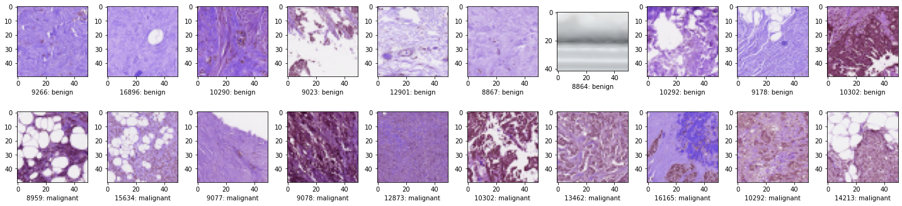
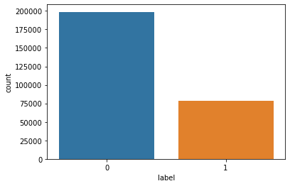
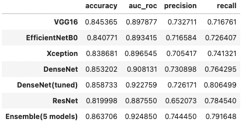

# Histopathology Images Classification
---

# Introduction & Objective

Invasive Ductal Carcinoma (IDC) is the most common type of breast cancers. It account for 80% of breast cancer diagnoses. Typically, there are non-invasive diagnostic techniques such as (1) mammography, (2) ultrasound and (3) Magnetic Resonance Imaging (MRI). However, to medical practitioners maybe still use biopsy techniques to analyze the whether the cells are malignant. This process includes collecting tissues samples, and analyze them under microscope. 

As such, the goal of this project is to train a deep learning model to classify a malignant or benign breast tissue cells.

# Data

There are a 277524 images from from [kaggle](https://www.kaggle.com/paultimothymooney/breast-histopathology-images) dataset.71% of the images are labelled as IDC(+) and 29% of the images are labelled as IDC(-). 

# Image Classification with Transfer learning

Following pre-trained models are evaluated: 
- VGG16
- EfficientNetB0
- Xception
- DenseNet121
- ResNet152v2
- Ensembling 

# Results

# Conclusion 

Ensemble model is the best performing model. It has (1) 86% accuracy, (2)0.92 roc auc, (3) 74% precision, (4) 79% recall.